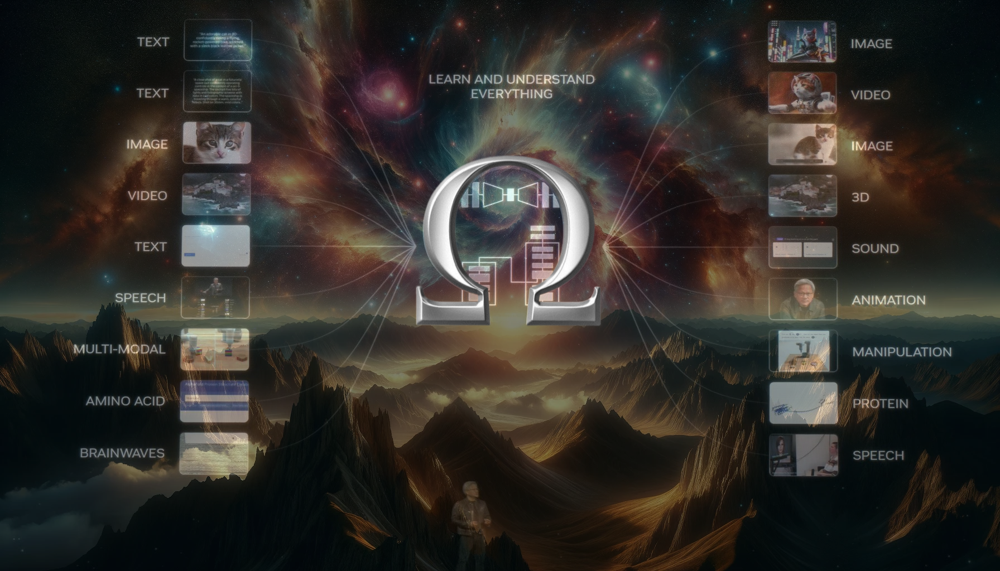

<div align="center">

# OMEGA Labs Bittensor Any-to-Any Subnet
[](https://omegatron.ai)
[](https://opensource.org/licenses/MIT)

---
### Be, and it becomes ...
---
</div>

- [Introduction](#introduction)
- [Our Vision](#our-vision)
- [Roadmap](#roadmap-v01)
- [Application Layer](#application-layer-real-world-access--impact)
  - [Partnership](#-partnership-spotlight-clayo)
  - [Live Access](#️-sn21ai-muse-live-voice-to-voice-for-everyone)
- [Getting Started](#getting-started-)
  - [For Miners](#for-miners)
  - [For Validators](#for-validators)
- [Current A2A Architecture](#current-a2a-architecture-)
- [The Future of A2A](#the-future-of-omega-a2a-)
- [Incentives](#incentives-)
- [Acknowledgements](#acknowledgements-)
---

## Introduction

**OMEGA Any-to-Any** is a decentralized, open-source AI project built on the Bittensor blockchain by OMEGA Labs. Our mission is to create state-of-the-art (SOTA) multimodal any-to-any models by attracting the world's top AI researchers to train on Bittensor, taking advantage of Bittensor's incentivized intelligence platform. Our goal is to establish a self-sustaining, well-resourced research lab, where participants are rewarded for contributing compute and/or research insight.

**MainNet UID**: 21

**TestNet UID**: 96

## Our Vision

#### 🧠 A Multimodal-First Foundation

Our long-term focus is **true any-to-any modeling**—models that **jointly learn** from all modalities and express a **deeper understanding of the world** through associative representations. This isn’t just about data format translation; it’s about building models that **see patterns across domains**, capturing richer, more universal signals.

#### 🗣️ Starting with Voice-to-Voice

To build toward that future, our current focus is on **voice-to-voice generation**—training models that can fluently listen, understand, and respond. Speech is one of the most information-dense and underexplored modalities, making it the perfect starting point. Success here lays the foundation for more complex multimodal capabilities.

#### 📐 The Platonic Representation Hypothesis

As models grow, something remarkable happens: whether trained on images, text, or audio, **their internal representations begin to align**. We believe this trend is pointing toward a **shared statistical model of reality**—a *Platonic representation* where different modalities map to the same underlying concepts.

SN21 is designed to support that convergence: by evaluating, rewarding, and encouraging models that move us closer to this **unified understanding**.

#### 🛠️ Built for Builders & Researchers

SN21 aims to function as a **self-sustaining, open research lab** where contributors—whether they're providing compute, training models, or designing evaluations—are **incentivized for pushing the frontier**. With Bittensor's reward infrastructure, researchers and engineers are compensated permissionlessly for real impact.

#### 🌍 Open, Decentralized, Demand-Driven

We embrace a **community-driven roadmap**, where feedback, public interest, and real-world demand influence what we prioritize. Every update, benchmark, and leaderboard improvement is shared in the open. And in the future, SN21 will serve as a **high-bandwidth router** for specialized models across subnets, bootstrapping new applications with rich, multimodal embeddings.

---

### Our Commitment to the Community

- **⚖️ Fair & Innovation-Aligned Incentives**

    We're committed to reward mechanisms that **push real progress**, penalize stagnation, and make emissions meaningful. Innovation shouldn't just be encouraged—it should be *necessary to win*.

- **🔍Radical Transparency**

    We’re building in public. Expect **regular updates** in our Discord, and full visibility into evaluation metrics, miner performance, and validator behavior.

    📊 A revamped **dashboard & leaderboard** will offer metric-level clarity, moving averages, and emissions insights—so miners truly understand how they’re performing.

- **🧠 Collaborative Growth**

    ​Our community isn’t just a group of miners — it’s a **think tank for frontier AI**. Your insights, discussions, and pattern-spotting directly shape SN21’s evolution.

    You’ll have avenues to contribute via **Discord threads** on -

    - **Leaderboard performance observations**

    - **Evaluation metric design & tweaks**

    - **Bug reports & emission anomalies**

    - **SOTA model evaluations & ideas**

---


## Roadmap v0.1🚀
### **Phase 1: Build the Bedrock** ✅ **SHIPPED**

**🎯 Goal:** Lock down a **rock-solid base of trust, transparency, and reward alignment** that can scale with SN21’s ambitions.

**Key Deliverables:**

- ✅ **New Emissions Mechanism - SHIPPED**

    - A 75/25 emissions split: models **above a dynamic performance baseline** share 75% emissions; those below share 25%.

        > Imagine your efforts to **push the limits** being rewarded with access to the **premium 75% emissions pool**.

        This majority share is **exclusively reserved for models that surpass the performance baseline**— ensuring that real innovation gets the recognition (and rewards) it deserves.

    - Reputation score that rewards innovators who beat the baseline consistently.

- ✅ **Metric-Driven Leaderboard - SHIPPED**

    Reveal full transparency into performance breakdowns: MIMI, PESQ, WER, response timing, and more.

- ✅ **Validator Consistency & Trust Tools - SHIPPED**

    Tracking script updates, runtime reliability, and emissions from all validators. Making validator behavior visible and accountable.

- ✅ **Open Communication Rhythm - SHIPPED**

    Frequent updates on Discord: bug reports, emissions graphs, leaderboard anomalies, research discussions.

---

### 🧠 **Phase 2: Race to the SOTA (Near-Term Goals)** ✅ **SHIPPED**

**🎯 Goal:** Benchmark against the world’s best, and push SN21 submissions toward true **state-of-the-art performance**.

**Key Deliverables:**

- ✅ **SOTA Intelligence & Integration**

    Ongoing tracking and benchmarking against elite models like **GPT-4o**, **Moshi**, and others in any-to-any generation. Tracked the comparison internally for `v1` competition - which led to insights on the competition, eventually lead to updating the competition.

- ✅ **Refined Evaluation Standards - SHIPPED**

    Research, Exploration and iteration on robust metrics: including but not limited to **MIMI token distance**, **WER**, **PESQ**, **VAD overlap**, **pause fluency**.

- **Public Benchmark Comparisons**

    Showcase SN21 performance vs. top open/closed source baselines—make our progress visible to the broader ML community.

- ✅ **Enhanced Miner Dashboard**

    Metric breakdowns, emissions history, trend graphs, and possibly gamified features like:

    - 🏅 Achievement badges

    - Improvement streaks

    - Performance decay/recovery indicators

---

### 🌍 **Phase 3: Scale the Impact (Current focus)**

**🎯 Goal:** Expand SN21’s utility, attract more top-tier talent, and evolve into a top-3 emissions subnet.

**Key Deliverables:**

- ✅ **Ecosystem & Docs Overhaul - SHIPPED**

    More complete miner/dev documentation, sample validators, and easier onboarding for new contributors.

- **Feedback-Driven Evaluation Evolution**

    Log anonymized user feedback & real-world usage from sn21.ai—using it to tweak the evaluation logic dynamically.

- **Grow a Builder Culture**

    Build a subnet that’s not just about mining—but about *building things on top*. We want devs to prototype apps, demos, and toolkits using SN21 models.

---


## 🔌**Application Layer: Real-World Access & Impact**

While SN21’s core mission is to push the boundaries of any-to-any model development, we’re equally committed to ensuring these capabilities drive **real-world value**. Our **API layer** and flagship applications are designed not just to showcase research—but to power **business use cases**, generate **revenue**, and create a thriving ecosystem around voice-first AI.

---

### 💼 **The Voice Opportunity: Real Demand, Real Revenue**

Voice interfaces are no longer just futuristic demos—they’re a growing industry. From AI contact centers to voice agents, smart tools, and accessibility tech, businesses are actively looking for **high-quality, customizable voice models** they can trust.

SN21’s low-latency, speaker-adaptive, multilingual voice models are already seeing demand across multiple verticals. Through our API, we’re enabling developers and companies to **deploy production-grade voice solutions**—and in doing so, creating real **economic pull** for the subnet.

---

### 🤝 **Partnership Spotlight: Clayo**

One example is our work with **Clayo**, a startup building next-generation AI contact center tools. They are integrating SN21’s voice-to-voice API to power seamless, dynamic agent interactions—demonstrating how **SN21 models can directly serve high-demand B2B workflows**.

This kind of real-world usage doesn't just validate our models—it also drives emissions back into the subnet through demand.


---

### 🎙️ **sn21.ai (Muse): Live Voice-to-Voice for Everyone**

[OMEGA Muse](https://sn21.ai/), also known as *Muse*, is our public platform for exploring SN21’s latest voice models. It lets anyone:

- Experience real-time voice-to-voice generation

- Evaluate speed, fluency, and expressiveness

- Provide feedback that directly improves the subnet

Muse isn’t just a showcase—it’s a living testbed. Every interaction informs evaluation logic, helping the subnet evolve based on actual usage, not just abstract metrics.

---

### 🛠️ **SN21 Voice API: Powering Integration & Ecosystem Growth**

Our API enables developers to plug SN21’s SOTA voice models into their own tools, bots, and applications. It's built for:

- Fast, scalable integration

- High-availability voice generation

- Use cases ranging from call centers and education to entertainment and accessibility

As adoption grows, so does the economic value of emissions—creating a **self-reinforcing loop** between model quality, usage, and miner rewards.


## Getting Started 🏁

### For Miners

#### Requirements
- Python 3.11+ with pip
- GPU with at least 40 GB of VRAM; NVIDIA RTXA6000 is a good choice, or use a 1024xH100 if you wanna train a **really** good model :sunglasses:
- At least 40 GB of CPU RAM
- **API Keys**: CHUTES_API_KEY and OPENAI_API_KEY (for evaluation)
- If running on runpod, `runpod/pytorch:2.2.1-py3.10-cuda12.1.1-devel-ubuntu22.04` is a good base template.

#### Setup
1. Clone the repo and `cd` into it:
```bash
git clone https://github.com/omegalabsinc/omegalabs-anytoany-bittensor.git
cd omegalabs-anytoany-bittensor
```

2. Install the requirements:
  - Using docker: `make build-and-run`
  - Using your local Python: `pip install -e .`

3. Set up API keys (required for evaluation):
```bash
# Option 1: Environment variables
export CHUTES_API_KEY="your_chutes_api_key"
export OPENAI_API_KEY="your_openai_api_key"

# Option 2: Add to vali.env file
echo "CHUTES_API_KEY=your_chutes_api_key" >> vali.env
echo "OPENAI_API_KEY=your_openai_api_key" >> vali.env
```

#### Model Development & Testing

**🧪 Test Your Model Locally First**

Before deploying, use our testing framework to evaluate your model with the same logic validators use:

1. Start your voice model server with the required API endpoint: `POST /api/v1/v2t`
2. Test locally: `python -m tests.test_model_scoring_server --experiment_name "my-test"`

📋 **See [miner_testing_guide.md](docs/miner_testing_guide.md) for complete testing guide**

#### Model Deployment

1. Log into Huggingface: `huggingface-cli login`

2. Upload your model to Huggingface:
```bash
python miner_utils/upload_model.py \
    --hf_repo_id {HF REPO ID e.g. your-username/your-voice-model} \
    --wallet.name {miner wallet name} \
    --wallet.hotkey {miner hotkey} \
    --model_dir {your model directory} \
    --netuid 21
```

**TestNet**: Add `--subtensor.network test --netuid 96` for testing.

#### Current Competition: VoiceBench v2 🎤

Your model will be evaluated on **4 comprehensive datasets** including:
- **CommonEval**: General knowledge and reasoning
- **WildVoice**: Real-world audio scenarios  
- **IfEval**: Instruction following
- **AdvBench**: Safety and robustness

**Scoring**: Advanced LLM-based evaluation measuring accuracy, fluency, and task completion across diverse voice scenarios.

### For Validators

To read the validator set-up documentation, see [docs/validator_setup.md](docs/validator_setup.md).

## Current A2A Architecture 🤖

At launch, we are starting with an approach that builds on one of the most powerful and mainstream LLMs as a backbone: Llama 3. A multilayer perceptron (MLP) projects Imagebind embeddings directly into the pretrained Llama 3 internal state, allowing a finetuned model to develop video understanding.

The provided mining repo with default settings will train both:

-  the encoding projection layer, which encodes Imagebind embeddings into Llama 3 states, and
-  a LoRA adapter which allows the underlying LLM to develop multimodal understanding

There are several immediate areas miners can investigate in order to produce a checkpoint with improved multimodal understanding:

- Train for longer,
- Find better hyperparameters: learning rate, optimizer, batch sizes, gradient accumulation, etc.,
- Use additional datasets (more diverse, or even larger than the SN24 dataset),
- Try different LoRA parameters, or finetune all parameters.

In the near future we'll enable much deeper architecture search, allowing researchers to experiment with different LLM backbones, vastly different encoders and decoders.

## The Future of OMEGA A2A 🔮

OMEGA A2A is poised to revolutionize the AI landscape by harnessing the power of Bittensor's incentivized intelligence model and attracting the world's top AI researchers. Our mission is to push the boundaries of what's possible in decentralized AI, focusing on:

- Developing fully multimodal, any-to-any models that outperform all other open-source solutions
- Creating an AI gateway framework to seamlessly integrate and evaluate models from across the Bittensor ecosystem and beyond
- Implementing task-driven learning and agent-focused validation to create models capable of completing complex, real-world tasks
- Powering up the OMEGA Focus app with cutting-edge multimodal intelligence and personalized digital twin companions

As we progress, we will explore fully decentralized infrastructure and governance to ensure a truly democratized AI ecosystem. Our research will explore groundbreaking architectures beyond transformers and attention mechanisms, pushing the limits of AI capabilities.

By hyper-connecting to the Ω SN24, we will access diverse, high-quality data that fuels our models' growth and enables them to tackle a wide range of tasks. Innovative monetization strategies will be implemented to sustain and grow the ecosystem, ensuring long-term success and viability.

Through the tireless efforts of our decentralized OMEGA A2A research collective, we aim to showcase the immense potential of Bittensor's incentivized intelligence model and establish ourselves as leaders in the AI research community and beyond.

Join us on this transformative journey as we shape the future of decentralized AI, unlocking new possibilities and creating a more accessible, powerful, and innovative AI ecosystem for all. :rocket:

## Incentives 🎂

We aim to collectively push forward the SOTA of multimodal and agentic AI research. The incentives in this subnet will evolve as we add modalities and tasks, but they will consistently reflect this underlying goal.

The initial reward structure has two parts:

- Video understanding: can your checkpoint understand and accurately caption video embeddings?
- Language capabilities: does your checkpoint retain the language capabilities of the LLM backbone?

As we improve the incentive scheme over time to create better and more diverse multimodal capabilities, we'll give ample notice and detail of upcoming changes.

## Acknowledgements 🙏

Thank you to [Nous Research](https://github.com/NousResearch/finetuning-subnet), [MyShell](https://github.com/myshell-ai/MyShell-TTS-Subnet), and [Impel](https://github.com/impel-intelligence/dippy-bittensor-subnet) for the structure of the miner chain model upload and validator comparison scoring logic!
